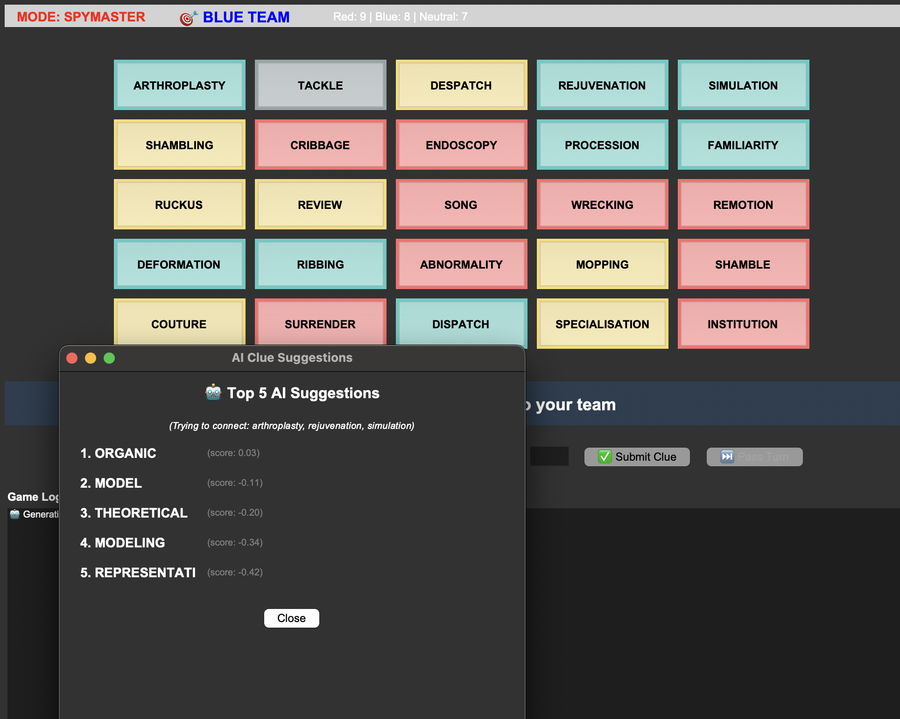
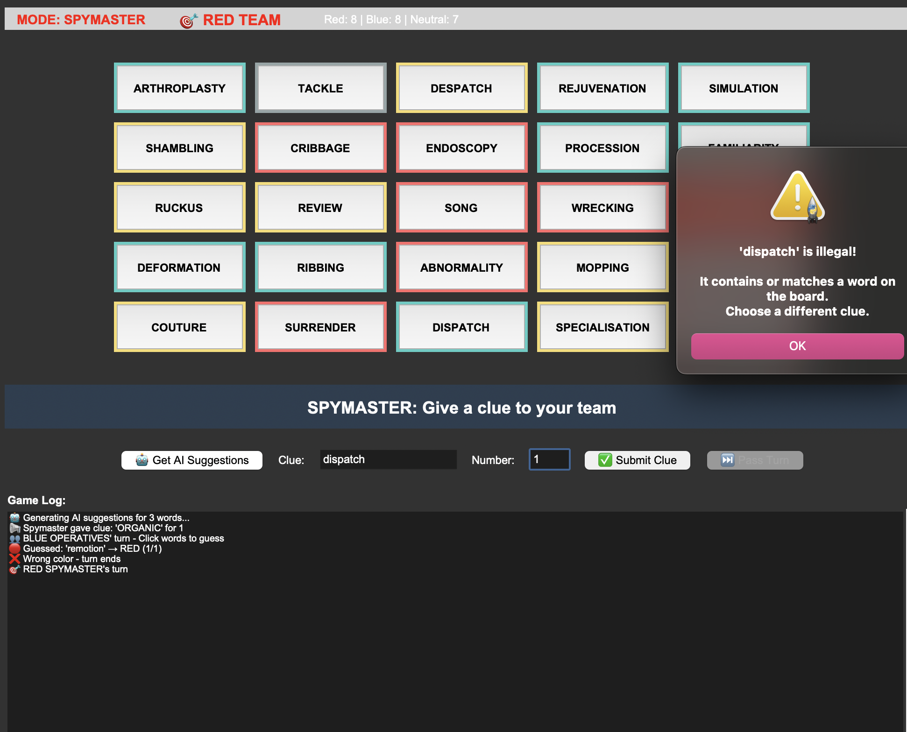

# Codenames AI 🎮🤖

An intelligent Codenames game implementation with AI-powered clue generation using WordNet and Word2Vec embeddings.

## Features

- **Full Codenames gameplay** - 25-word board (9 red, 8 blue, 7 neutral, 1 assassin)
- **AI clue generation** - Smart suggestions using WordNet hypernyms and GloVe embeddings
- **Automatic mode switching** - Spymaster → Operative views
- **Illegal clue validation** - Prevents clues containing board words
- **Continuous play** - Teams keep turn when all guesses are correct
- **Color-coded interface** - Visual spymaster view with card colors

## Screenshots


*Spymaster view with color-coded cards*


*AI-generated clue suggestions with confidence scores*


*Validation prevents illegal clues*

## Installation
```bash
# Install dependencies
pip install nltk gensim regex --break-system-packages

# Download NLTK data (run in Python)
import nltk
nltk.download('wordnet')
nltk.download('stopwords')
```

## Usage
```bash
python codenames_gui.py
```

**Game Flow:**
1. Spymaster views color-coded cards
2. Click "Get AI Suggestions" for intelligent clues
3. Enter clue + number of words
4. Operatives click cards to guess
5. First team to reveal all their words wins!

## Project Structure
```
codenames/
├── codenames_game.py    # Core game logic (no I/O)
├── codenames_gui.py     # Tkinter GUI interface
└── README.md
```

## How It Works

### AI Clue Generation
```python
# 1. Extract hypernyms from WordNet
"dog" → "canine" → "mammal" → "animal"

# 2. Score using Word2Vec similarity
score = Σ(similarity to targets) - penalty × Σ(similarity to avoid)

# 3. Rank and return top suggestions
```

### Illegal Clue Detection
- **Substring matching**: "cat" in "category" → ❌
- **Stemming**: "running" vs "run" → ❌
- **Case-insensitive validation**

## Customization

**Adjust AI risk level:**
```python
# In codenames_gui.py, show_suggestions()
scored = score_clues(..., risk_aversion=2.0)  # Higher = more cautious
```

**Change board size:**
```python
# In codenames_game.py, setup_game()
def setup_game(num_words=25):  # Standard 5x5
```

## Technical Stack

- **Python 3.8+**
- **NLTK** - WordNet semantic relationships
- **Gensim** - GloVe word embeddings (100D, ~128 MB)
- **Tkinter** - Cross-platform GUI
- **Porter Stemmer** - Word root detection

## Game Rules

- Spymaster gives one-word clue + number
- Operatives guess that many words
- **Correct** (your color) → continue
- **Wrong** (opponent/neutral) → turn ends
- **Assassin** → immediate loss
- **All correct** → team keeps turn (house rule)

## License

MIT License © 2025 sunotsue

## Credits

- **Codenames** by Vlaada Chvátil
- **NLTK** WordNet
- **GloVe** embeddings by Stanford NLP
- **Gensim** for Word2Vec
